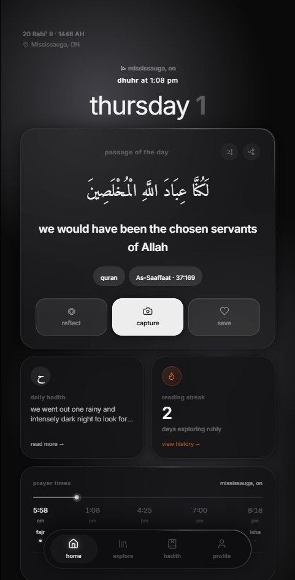
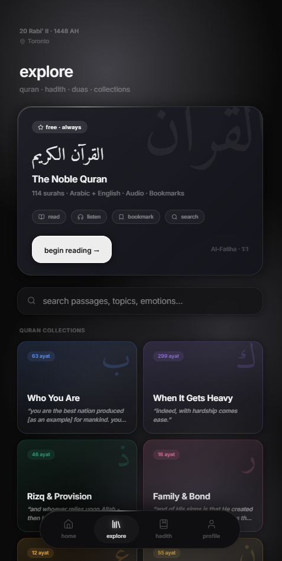
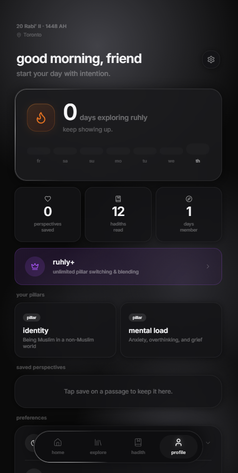
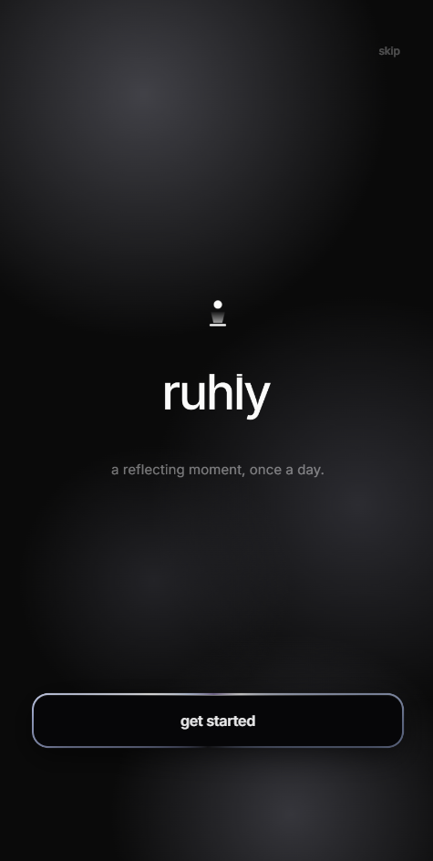
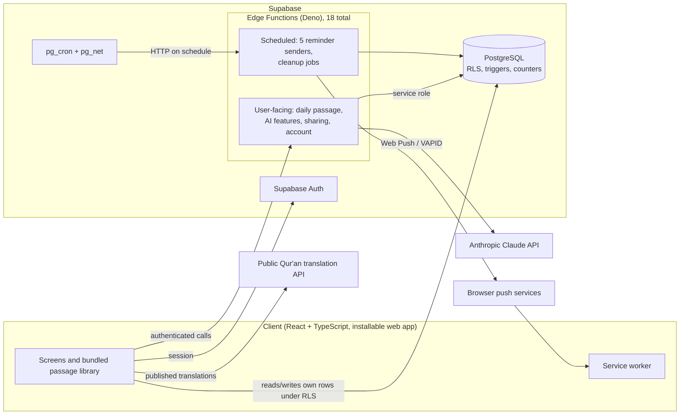

# Ruhly

Ruhly is a daily Islamic reflection app. Each day it gives the user one passage, a Qur'an verse or a hadith, chosen for what they are going through right now rather than for a fixed calendar. It is built for young Muslims, mostly in the West, who want a short and serious daily habit in their own language. For many of them that habit today is a generic "verse of the day" widget, scrolling through social media, or nothing at all. Around that daily passage, Ruhly lets the user ask grounded questions about it, save it, share it as an image, and get reminders timed to prayer and to the week.

**Status:** Launching November 2026.

**Team:** Ruhly is built by me, Mazen Talsam, and my cousin Zackariah Telsem. Zackariah leads product, design and content curation. I built the engineering: the React and TypeScript client, the Supabase data model and security rules, all 18 Edge Functions, the six Claude-powered features, the push notification system, and support for 8 languages.

**At a glance:** about 1,000 curated passages · 8 languages, 2 of them right to left · 18 serverless functions · 6 AI features with per-user and global rate limits · 5 scheduled reminder types

## Screenshots

| Home | Explore | Profile | Onboarding |
|---|---|---|---|
|  |  |  |  |

## The problem

Most Islamic apps send the same verse of the day to every user. That is easy to build and cache, and it is easy to ignore, because a verse about inheritance law lands the same way on someone grieving as on someone celebrating. Choosing a passage for each person sounds like a search problem, but it is mostly a content problem. Mood is not something you can find with keywords. A passage about patience can comfort someone grieving or rebuke someone who is impatient, so each passage needs a person to curate it and tag it by theme. The selection then has to avoid repeats over months and stay the same on every device for the whole day, and the day itself starts at Fajr, not midnight.

Language makes all of this harder. A user reading in Somali or Tigrinya should get the same quality as one reading in English, but published Qur'an translations do not exist for every language. Commentary also cannot be machine-translated without controls. On top of that, the whole interface may need to run right to left.

## Architecture

The client is a React and TypeScript single-page app built with Vite. It can be installed to the home screen and runs a service worker for push notifications. The curated passage library, about 1,000 entries, ships with the client. The server deals in passage IDs and themes, not passage text. This keeps responses small and means copyrighted reflection text is not duplicated in the database. Every user has a Supabase Auth session from first launch, and anonymous sessions are upgraded in place when the user creates an account. So there is always a real user ID for row-level security and for rate limits.

PostgreSQL is the source of truth for anything a client could fake: entitlements, the daily passage, streaks, saved-passage counts, and usage counters. RLS restricts users to their own rows. Rules that depend on how many rows a user already has are enforced inside the database, not by the client. Clients write simple user state directly under RLS. Anything that needs a secret, costs money, or applies to more than one user goes through one of the 18 Edge Functions on Deno, which run with the service role. That covers the daily-passage draw, the six Claude features, share links, account deletion and the waitlist.

Scheduled work runs on pg_cron, which uses pg_net to call Edge Functions over HTTP. These functions are idempotent and do not depend on the schedule. Each one asks the database which users are due and records what it has sent. Running a job twice or late therefore never sends a duplicate notification.

## Tech stack

| Layer | Technology |
|---|---|
| Client | React 18, TypeScript, Vite, Tailwind CSS 4, React Router 7, Motion |
| Backend | Supabase: PostgreSQL, Auth, row-level security |
| Server logic | 18 Supabase Edge Functions (Deno) |
| Scheduling | pg_cron + pg_net |
| AI | Anthropic Claude API |
| Notifications | Web Push with VAPID, service worker |
| Share images | Satori + resvg (server-rendered Open Graph cards) |
| Hosting | Railway (Node static server) |
| Testing | Vitest, plus scripted evaluations of the AI features |

## Engineering notes

### Free-tier caps enforced in the database

Free accounts have limits, such as how many passages they can save and how many themes they can follow. The obvious approach checks the count in the client or an Edge Function and then inserts. That fails in two ways. Anyone can call the REST endpoint directly and skip the check, and two requests at the same moment both read the same count and both get through. Ruhly enforces each cap with a trigger on the table, so the rule applies however a row arrives. Usage counters, such as daily AI questions, are updated by a database function. It locks the user's counter row before reading it, so a second request at the same moment waits and then sees the updated count. Entitlement is read on the server. If an entitlement row is missing, the account is treated as free.

### Internationalization across 8 languages

Ruhly supports English, Arabic, Urdu, French, Indonesian, Somali, Amharic and Tigrinya. Translating interface strings is the easy part. Arabic and Urdu run right to left, so every layout uses logical directions rather than left and right. Mixed text, such as Arabic scripture inside an English sentence or Latin numbers inside Urdu, needs explicit direction handling. That applies to the generated share images too, not only the DOM. For passage content, scripture is never machine-translated where a published human translation exists; the client fetches that translation. Commentary and hadith text are translated once per passage and language, then cached and shared by all users. The server only accepts source text whose hash matches the bundled original, so nobody can store an arbitrary "translation" under a real passage ID. Tigrinya has no published Qur'an translation, so it uses a restricted prompt that only allows a faithful translation.

### Six Claude-powered features

Claude powers six features: questions about a passage, automatic passage insights, passage translation, a dua companion, worked dua examples, and a weekly digest. Wrapping a general chat model in an app produces confident fatwas, invented hadith, and prompts that can be hijacked. Every feature is limited to the passage or task in front of the user. It declines fiqh rulings and judgments on hadith authenticity. User text is treated as data to answer, never as instructions to follow. Where possible the model chooses from a closed set and does not generate freely. The dua companion maps a situation to one of twelve themes written in advance. Shared outputs are cached by passage, not by user, so most requests never reach the model. Model calls that do happen are limited per user each day and by a global daily ceiling for each feature, so a spike cannot run up unbounded cost.

### Push notifications on Web Push and VAPID

Ruhly sends five scheduled reminder types: a daily passage reminder, a reminder in the last third of the night, a Friday sadaqah reminder, a nudge suggesting a theme the user's recent reading leans toward, and a weekly digest. A hosted push vendor would have been simpler, but it would put another company between the user and their reminders and share subscription data with it. Notifications instead use the Web Push standard with Ruhly's own VAPID keys and a service worker. Subscriptions are stored in Postgres under RLS. The naive version, a cron job that loops over every user, fails on time zones and prayer times, and it sends duplicates whenever a job retries. Each sender asks the database which users are due in their own local time and records each send. Dead subscriptions are removed automatically. Users opt in to each reminder separately.

---

The source code is private. I'm happy to walk through it, including the database design and the AI safety approach, on a call.
